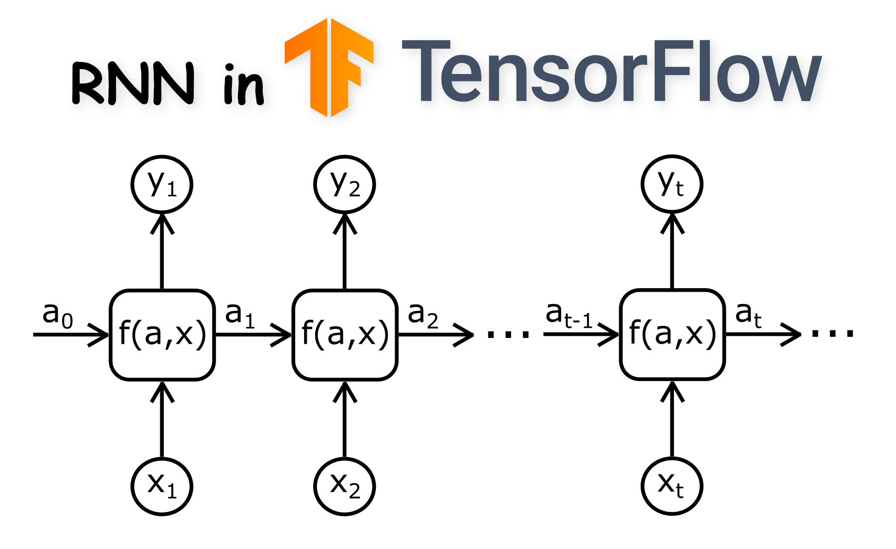

# Redes neuronales recurrentes para procesamiento de lenguaje natural

## Descripción
En este repositorio, exploramos cómo implementar una red neuronal recurrente (RNN) para la generación de texto, utilizando un enfoque basado en caracteres. 
La RNN se entrena para predecir el próximo carácter en una secuencia de caracteres, lo que permite generar texto de manera iterativa.

## Inspiracion y base teorica
Este proyecto se inspira en el artículo "The Unreasonable Effectiveness of Recurrent Neural Networks" de Andrej Karpathy. 
Se basa en el modelo propuesto en su artículo y también se refiere al tutorial "Generate text with an RNN" de la web de TensorFlow.

## Implementación del Modelo:
El enfoque de modelado utilizado aquí es el de un "Character level language model", uno de los modelos pioneros en el procesamiento de texto a nivel de carácter. 
El modelo consiste en proporcionar una palabra a la RNN y luego pedirle que modele la distribución de probabilidad del siguiente carácter basado en la secuencia de caracteres anteriores. 
Al repetir el proceso, el modelo puede generar texto carácter a carácter.

## Dataset
Se utiliza un dataset "de juguete" en este ejemplo, con el propósito didáctico de centrarse en los conceptos de programación y aprendizaje de RNNs. 
Aunque los resultados del modelo pueden no ser óptimos en términos de calidad del texto generado, el enfoque es demostrativo y educativo.
Este repositorio busca brindar una introducción práctica a la implementación de redes neuronales recurrentes a nivel de caracteres y su aplicación en la generación de texto. Aunque el enfoque se mantiene didáctico, proporciona una base sólida para explorar y comprender más a fondo el poder de las RNNs en el procesamiento de lenguaje natural.

## Herramientas
- tensorflow
- keras
- numpy
- os
- time
- 
## Organización de carpetas
```
├── Primera_red_neuronal_con_numpy.ipynb                  # Archivo principal
├── src                                                   # Archivos dataset
│   ├── fragmento-de-libro.txt                                 
├── img                                                   # imagenes del repositorio gg
│   ├── rnnn.png
└── 
```

## Funcionamiento
<div align="center">
<a href="https://youtu.be/ACbtv4HB_io" target="_blank">

</a>
<p>Demostración de funcionamiento</p>
</div>

<br/><br/>


